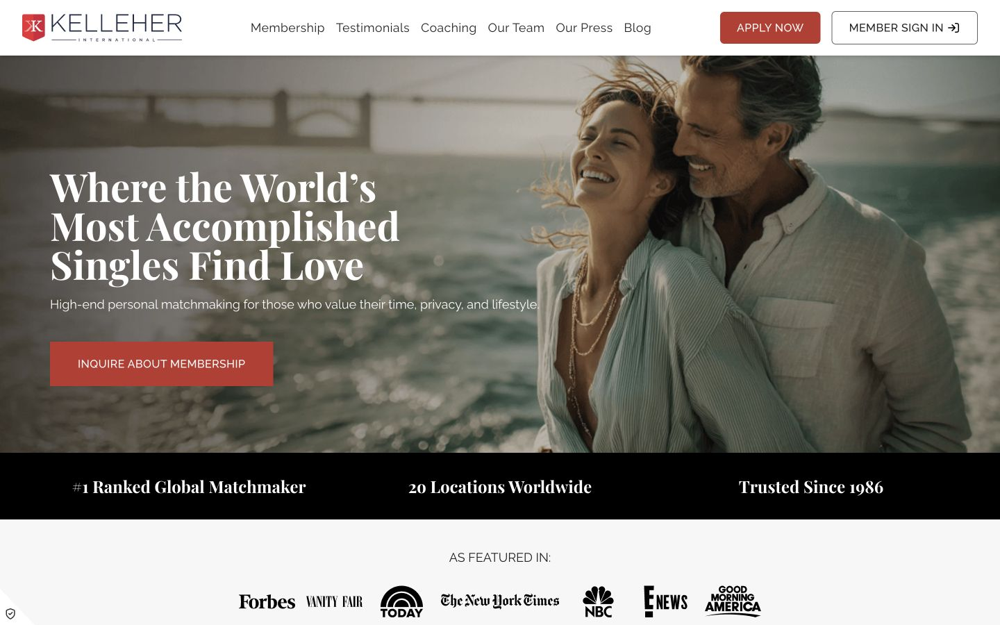
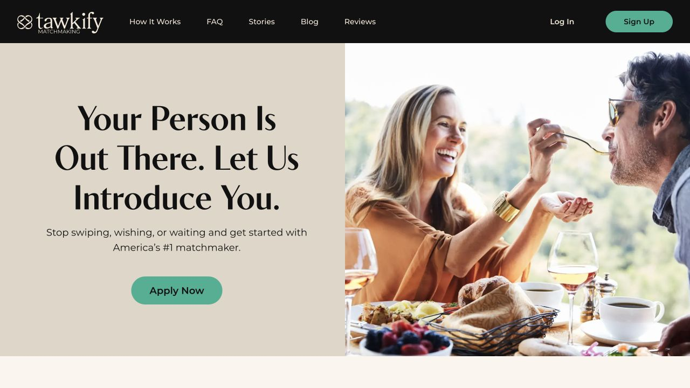
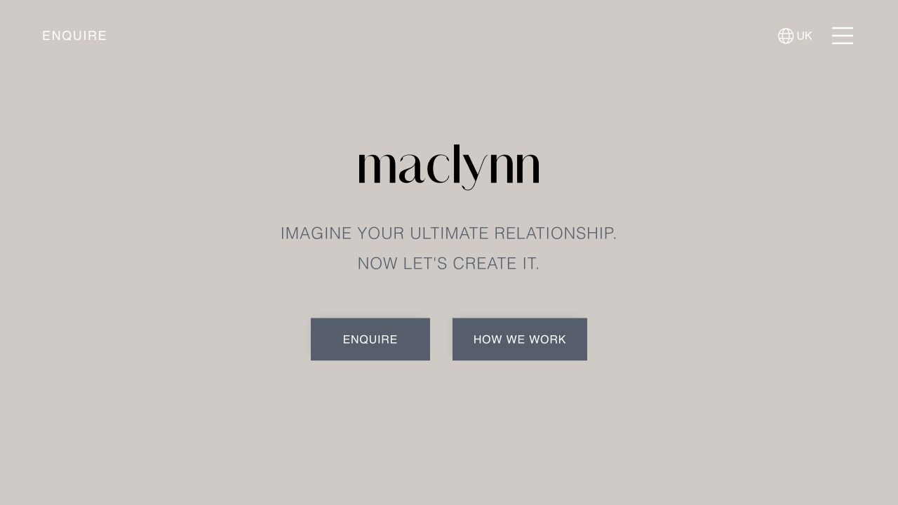
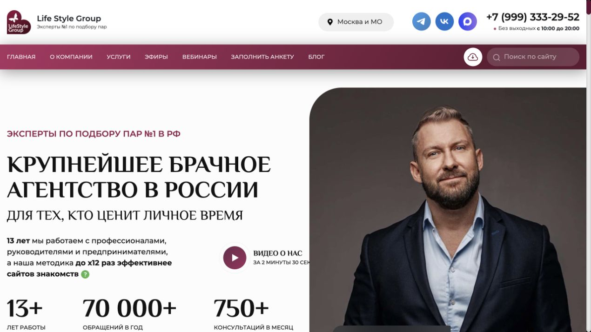
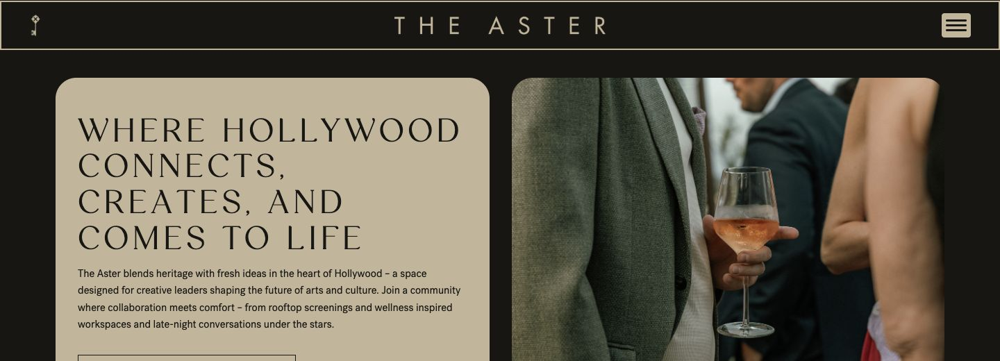
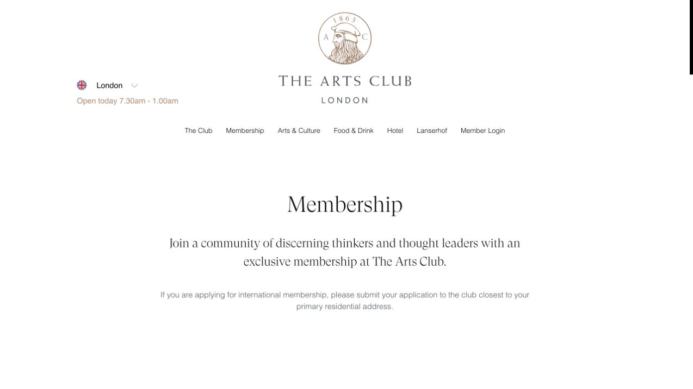
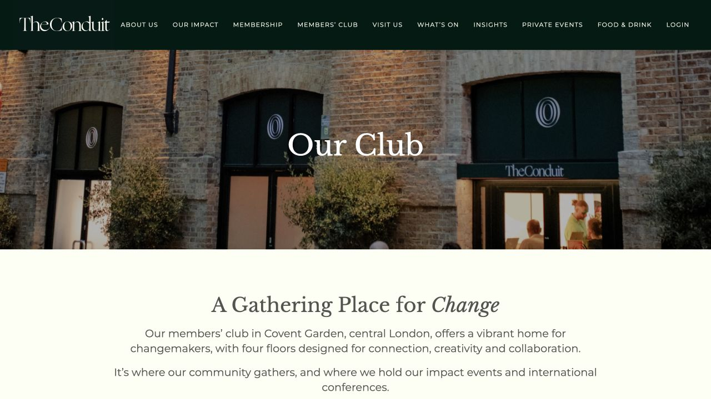
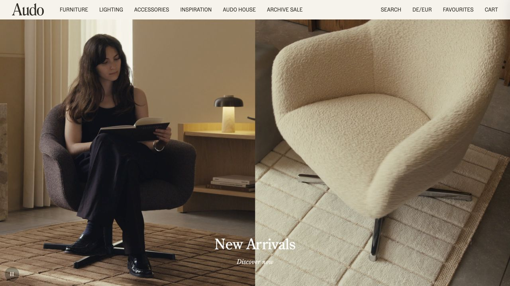
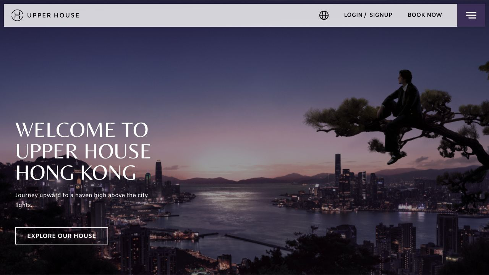

# Reference board

## Project

**Брачное агентство для серьёзных отношений**  
Россия + Китай · гибридный редакционный лендинг и каталог услуг · Core experience

## Search thesis

Референсы искались не по принципу «сайт про любовь», а по сочетанию пяти качеств:

1. услуга и следующий шаг понятны с первого экрана;
2. ощущаются конфиденциальность, личное сопровождение и высокий уровень сервиса;
3. визуальный язык современный, взрослый и не использует розовый цвет, сердца и свадебные клише;
4. есть место для экспертного лица основателя и профессиональной фотографии;
5. международность России и Китая выглядит естественно, а не как туристическая или фольклорная тема.

## How the shortlist was scored

Каждый кандидат получил от 0 до 2 баллов по пяти критериям: композиция, ясность, доверие, соответствие задаче и визуальная выразительность. В шорт-лист вошли только варианты с суммой от 7/10.

## Research pool

Просмотрено 18 кандидатов: Kelleher International, Selective Search, Maclynn, Tawkify, Life Style Group, «Счастливы и Женаты», NeueHouse, The Twenty Two, The Aster, The Arts Club, Aman, Design Hotels, Kinfolk, The Conduit, Audo Copenhagen, Upper House Hong Kong, The Court и Edition Hotels.

Часть кандидатов не вошла в шорт-лист из-за недоступности сайта, технически закрытого первого экрана или слабого соответствия концепции. «Счастливы и Женаты» оставлен как антипример: чёрно-золотая VIP-эстетика, свадебная фотография и демонстративная роскошь дают ровно тот эффект, которого проекту следует избегать. The Court исключён из-за признаков компрометации контента.

## Shortlist

### 01 — Kelleher International

- **Source:** https://kelleher-international.com/
- **Category:** direct competitor
- **Score:** 9/10
- **Composition takeaway:** один ясный тезис поверх крупной фотографии, заметный сценарий обращения и полоса доказательств сразу под первым экраном.
- **Style takeaway:** взрослая аудитория, мягкая естественная фотография и спокойная типографика.
- **What not to copy:** красный акцент, буквальную композицию «счастливая пара на весь экран» и громкие рейтинговые заявления без подтверждения.
- **Why it fits:** лучший ориентир на мгновенную понятность услуги и на сочетание эмоции с доверием.

### 02 — Tawkify

- **Source:** https://tawkify.com/
- **Category:** direct competitor
- **Score:** 8/10
- **Composition takeaway:** практичный split-screen: обещание и CTA слева, естественная жизненная сцена справа.
- **Style takeaway:** дружелюбный сервис можно показать без свадебной атрибутики.
- **What not to copy:** стандартную симметричную половинчатую сетку, мятный акцент и знак, визуально напоминающий романтический символ.
- **Why it fits:** полезен как эталон понятного первого экрана, особенно для первого прототипа.

### 03 — Maclynn

- **Source:** https://maclynninternational.com/
- **Category:** direct competitor
- **Score:** 7/10
- **Composition takeaway:** очень тихий экран с большим количеством воздуха и двумя чёткими маршрутами.
- **Style takeaway:** премиальность может строиться на ритме, масштабе текста и сдержанности, а не на декоративной роскоши.
- **What not to copy:** почти пустой первый экран и слишком общее обещание, из которого не сразу понятен формат работы.
- **Why it fits:** задаёт нижнюю границу визуального шума и показывает, насколько лаконичным может быть сервис.

### 04 — Life Style Group

- **Source:** https://lifestylegroup.ru/
- **Category:** direct competitor · Russian market
- **Score:** 8/10
- **Composition takeaway:** личный эксперт как главный носитель доверия; конкретные показатели и опыт собраны рядом с основным тезисом.
- **Style takeaway:** портрет основателя может работать сильнее обезличенной стоковой пары.
- **What not to copy:** перегруженную двухэтажную навигацию, множество каналов связи одновременно и чрезмерно крупные статистические обещания.
- **Why it fits:** особенно полезен для будущего блока о профессиональном фотографе и личном сопровождении.

### 05 — The Aster

- **Source:** https://www.theasterla.com/membership/
- **Category:** adjacent industry · private members club
- **Score:** 9/10
- **Composition takeaway:** два крупных редакционных модуля — смысловой и фотографический — создают выразительный первый экран без сложной графики.
- **Style takeaway:** графит, тёплый беж, тонкие рамки и крупная антиква дают ощущение закрытого современного клуба.
- **What not to copy:** слишком большое количество скруглений и буквальное повторение чёрно-бежевой схемы.
- **Why it fits:** сильный ориентир для раздела закрытых встреч и клубной атмосферы.

### 06 — The Arts Club

- **Source:** https://www.theartsclub.co.uk/membership/
- **Category:** adjacent industry · private members club
- **Score:** 7/10
- **Composition takeaway:** строгая центральная ось и большие поля создают церемониальность и ощущение отбора.
- **Style takeaway:** доверие можно выражать тишиной, точной иерархией и небольшим количеством элементов.
- **What not to copy:** гербовую стилистику, чрезмерную пустоту и слишком консервативный тон.
- **Why it fits:** полезен для страницы или секции «Клуб» и для деликатной подачи конфиденциальности.

### 07 — The Conduit

- **Source:** https://www.theconduit.com/our-club/
- **Category:** adjacent industry · community and private club
- **Score:** 9/10
- **Composition takeaway:** фотография реального пространства сменяется светлым смысловым блоком; переход сразу объясняет, что клуб — это люди и место встреч.
- **Style takeaway:** глубокий зелёный, молочный фон и редакционная антиква близки утверждённой палитре проекта.
- **What not to copy:** длинную горизонтальную навигацию и буквальную фасадную фотографию.
- **Why it fits:** самый прямой ориентир для темы закрытых встреч, доверительного сообщества и офлайн-знакомств.

### 08 — Audo Copenhagen

- **Source:** https://audocph.com/
- **Category:** material world · interiors and hospitality
- **Score:** 9/10
- **Composition takeaway:** асимметричный диптих даёт ощущение редакционной съёмки и позволяет показывать не только людей, но и атмосферу.
- **Style takeaway:** тёплые минеральные оттенки, дерево, фактурный текстиль, мягкий свет и чёрные детали.
- **What not to copy:** товарную навигацию и слишком буквальное интерьерное доминирование.
- **Why it fits:** задаёт материальный язык будущей съёмки, карточек услуг и фонов закрытых встреч.

### 09 — Upper House Hong Kong

- **Source:** https://www.upperhouse.com/en/hongkong/
- **Category:** adjacent industry · contemporary Asian hospitality
- **Score:** 9/10
- **Composition takeaway:** спокойный широкоформатный кадр, текстовый блок в безопасной зоне и компактная сервисная навигация сверху.
- **Style takeaway:** современный азиатский контекст передан через город, свет и атмосферу, без орнаментов и очевидных национальных символов.
- **What not to copy:** гостиничную кнопку бронирования, слишком тёмную фотографию и англоязычную капительную подачу во всех элементах.
- **Why it fits:** главный ориентир для деликатного визуального акцента на Китай и международный уровень агентства.

## Locked material direction

Временная серия из четырёх сгенерированных фотографий уже соответствует концепции: взрослые пары, естественные моменты, спокойная одежда, тёплый редакционный свет; две пары — русский/китайский союз. До появления реальной съёмки эти изображения используются только как иллюстративные и не будут выдаваться за истории клиентов.

## Director's recommended blend

Если собирать направление уже сейчас, наиболее цельная комбинация — **01 + 05 + 07 + 08 + 09**:

- 01 даёт ясность брачного агентства;
- 05 — современную модульную композицию;
- 07 — клуб и утверждённый глубокий зелёный;
- 08 — тёплый материальный мир;
- 09 — ненавязчивый международный акцент Россия–Китай.

## Selection status

**Selected by user:** `01 + 02 + 05`.

- **01:** ясность позиционирования, крупная фотография и компактный блок доверия.
- **02:** понятная текстово-фотографическая композиция и живая человеческая сцена.
- **05:** модульная клубная геометрия и ощущение закрытого пространства.
- **Explicit exclusion:** не использовать вино, бокалы, барную или вечериночную атмосферу; у 05 заимствуется только интерфейсный принцип.

Decision recorded on 2026-07-28.
